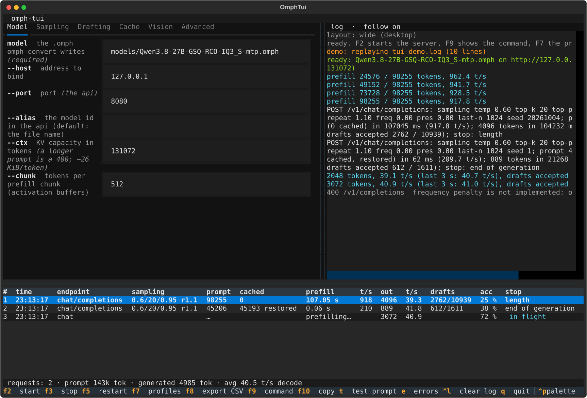
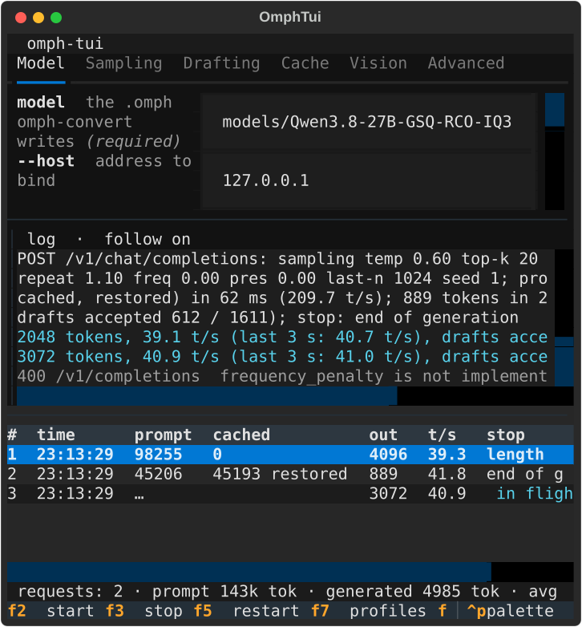

# The tools

Every binary the engine builds, what it is for, and every option it takes. The
server has its own reference in the
[README](../README.md#omph-server-in-full). The `OMPH_*` environment switches
are listed in [AGENTS.md](../AGENTS.md) and, authoritatively, in
`engine/src/runtime/options.hh` -- the tools below read the same ones, so
`omph-run`'s ablations work for `omph-generate` too.

A numeric option whose value is not entirely a number is refused with the flag
and the value it got (`--top-p 0.95--top-k` used to set `top_p` to 0.95 and
leave the rest as a stray argument, #306), so a typo cannot configure a run
half-way.

Which model file a tool takes: the engine binaries that *run* the model
(`omph-generate`, `omph-server`, `omph-run`, the C ABI) load only the `.omph`
that `omph-convert` writes -- a plain GGUF is refused with "is not an .omph
file: convert the GGUF with omph-convert (#178)". The validation tools
(`omph-dequant`, `omph-linear`, `omph-attn`, `omph-gdn`) open the **GGUF**
instead: they read the original bytes, which an `.omph` does not keep for the
tensors it repacks. The Python scripts in `tools/` take the GGUF path and derive
the `.omph` next to it (`tools/omph_model.py`).

| binary | what it is |
|---|---|
| [`omph-convert`](#omph-convert) | GGUF -> `.omph`: the only file the engine loads |
| [`omph-tokenize`](#omph-tokenize) | the tokenizer and the chat template, stdin to stdout |
| [`omph-generate`](#omph-generate) | text in, text out |
| [`omph-server`](../README.md#omph-server-in-full) | the OpenAI-compatible HTTP server |
| [`omph-capi-demo`](#omph-capi-demo) | the C ABI, exercised from plain C |
| [`omph-run`](#omph-run) | prefill a prompt, write its logits, optionally decode |
| [`omph-gguf-info`](#omph-gguf-info) | GGUF metadata and the tensor table |
| [`omph-device-info`](#omph-device-info) | HIP device probe and self test |
| [`omph-dequant`](#omph-dequant) | one tensor through the dequant kernel |
| [`omph-linear`](#omph-linear) | `y = x @ W^T` through the naive GPU path |
| [`omph-attn`](#omph-attn) | one attention layer through the engine's kernels |
| [`omph-gdn`](#omph-gdn) | one gated-delta-net layer |
| [`omph-attn-bench`](#omph-attn-bench) | the decode/verification attention alone, synthetic |
| [`omph-gemv-bench`](#omph-gemv-bench) | the fused GEMVs' bandwidth, per type and shape |
| [`omph-graph-probe`](#omph-graph-probe) | what a HIP graph is worth for one decode step |

## omph-convert

```
omph-convert <model.gguf> [out.omph]
```

Writes the engine's own container (#178). `out.omph` defaults to the input path
with `.gguf` replaced by `.omph`. Every tensor a fused kernel reads is repacked
into the kernel's layout and checked to rebuild the GGUF bytes bit for bit; the
metadata (hyperparameters, tokenizer, chat template) is copied verbatim with the
source's SHA-256 recorded. ~1 minute and 11.3 GiB for the 27B model.

The format version follows the tile types the model uses (IQ3_S tiles: 2,
IQ3_XXS: 3, IQ4_XS and Q4_K: 4, IQ2_S/Q2_K/IQ2_XS/IQ2_XXS: 5, Q6_K: 6, IQ1_M:
7); an `.omph` of another version is refused by every reader, so a model has to
be reconverted -- the DFlash2 drafter's `.omph` too -- after a format change.

No options besides the output path.

## omph-tokenize

```
omph-tokenize <model.gguf> [--no-parse-special] [--decode | --chat | --chat-ids] < input
```

| option | effect |
|---|---|
| *(none)* | text on stdin -> token ids on stdout, space-separated on one line |
| `--decode` | token ids on stdin -> text on stdout (control tokens included) |
| `--chat` | a JSON chat request on stdin (`text/chat.hh`, the same object `omph-generate --chat` takes) -> the rendered prompt |
| `--chat-ids` | the same, tokenized: the template's structure is parsed for special tokens, the request's own text is not (#292) |
| `--no-parse-special` | control tokens written in the *text* stay text (only meaningful outside the chat modes) |

The `--chat` rendering is byte-identical to the GGUF's Jinja template as
jinja2 renders it (`tools/check_chat_template.py`), and `--chat-ids` is what the
server would tokenize, so it is the tool to use to see what the model is
actually asked.

## omph-generate

```
omph-generate <model.omph> [options] < input
```

Input: a prompt (text), a JSON chat request with `--chat`, or token ids with
`--prompt-ids`. Output: the generated text, streamed, with timing and
speculation statistics on stderr (`--ids` prints the token ids instead).

| option | default | effect |
|---|---|---|
| `--chat` | off | read a chat request (JSON) instead of a plain prompt |
| `--prompt-ids` | off | read prompt token ids instead of text |
| `--ids` | off | print the generated token ids instead of text |
| `--max N` | `512` | tokens to generate |
| `--temp T` | `0` | sampling temperature; `0` is greedy |
| `--top-k K`, `--top-p P`, `--min-p M` | `0` / `1` / `0` | the truncations, applied top-k, then min-p, then top-p (top-p over the mass min-p kept) |
| `--seed S` | random | the sampling seed |
| `--repeat-penalty P` | `1.0` | llama.cpp's penalty, `1` is off |
| `--repeat-last-n N` | `64` | the window the three penalties look at, `0` is off |
| `--frequency-penalty P`, `--presence-penalty P` | `0` | OpenAI's pair, same window |
| `--no-spec` | off | no speculative decoding: plain greedy (or plain sampling since #197) |
| `--no-mtp` | off | do not load the MTP block (-352 MiB of VRAM) |
| `--dflash FILE` | off | draft with a DFlash2 drafter `.omph` instead of the MTP block (#245) |
| `--ctx N` | `8192` | KV capacity |
| `--cache-mib N` | `2048` | pinned host RAM for sequence checkpoints (`0`: none, #158) |
| `--kv-ram N` | `8192` | pinned host RAM for whole conversations (`0`: none, #179) |
| `--repeat N` | `1` | run the same request N times: the second and later restore the checkpoint before the generation prompt (#158) |
| `--then FILE` | off | then a second chat request from FILE: a conversation's next turn, which continues the cached sequence when it extends it |
| `--mmproj FILE` | off | the vision encoder (a build with `OMPH_LLAMA_DIR`, #160) |
| `--image FILE` | off | an image for the next image-pad token of the prompt; repeat for several, and with `--chat` one per image item of the request |
| `--logits-out FILE` | off | the logits after the prompt, f32 (validation) |
| `--force FILE` | off | decode these token ids instead (one per step); `--logits-out` then gets the prompt's row and every step's (validation) |

With a chat request the prompt comes from the template, so `--chat` is the way
to reproduce what the server does; `--then` plus `--repeat` is the cheap way to
check that a next turn resumes from the cache instead of prefilling.

## omph-server

The OpenAI-compatible server: see the
[README](../README.md#omph-server-in-full) for its options, the request fields
it reads, the response shape and the serving-relevant `OMPH_*` switches.

## omph-tui

```
uv run python omph_tui.py [options]
```

The terminal UI around `omph-server` (#304): pick the server's options in a form
one tab per group of the tables above, start it, watch its log, and read one row
per request -- prompt, cached/restored, prefill and decode rates, drafts
accepted, stop reason -- with the totals in the status line. It reads the
server's own log, so it also shows the requests another client (pi, curl) sent.




| option | default | effect |
|---|---|---|
| `--model FILE` | `models/Qwen3.8-27B-GSQ-RCO-IQ3_S-mtp.omph` | the `.omph` to serve |
| `--dflash FILE` | `models/Qwen3.8-27B-DFlash2-Q4_K_M.omph` when it exists | the DFlash2 drafter `.omph` the form starts on (`--dflash ""` for the MTP head) |
| `--profile NAME` | `coding-agent` | the profile to start the form from (see `tools/tui/profiles.py`: `default`, `coding-agent`, `long-context`, `fast`, `vision`) |
| `--binary PATH` | `engine/build/omph-server` | the server to run |
| `--exec CMD` | off | run this command instead of the server: a fake server for development |
| `--demo FILE` | off | replay a saved log instead of running anything |
| `--poll SECONDS` | `0.1` | how often the UI drains the server's lines |
| `--demo-delay SECONDS` | `0.05` | the delay between a replayed log's lines |
| `--screenshot FILE.svg` | off | write a screenshot of the real widgets and exit (how the images above were made) |

Keys -- every action has a letter (a phone's soft keyboard has no F-keys) and a
button (the title bar, the modals):

| key | action |
|---|---|
| `s` / `F2` | start the server with the form's options |
| `x` / `F3` | stop it (and its process group) |
| `r` / `F5` | restart |
| `p` / `F7` | profiles: load a row, `s` saves the current form, `d` deletes |
| `c` / `F9` | the command that will run, the `OMPH_*` line and the pre-flight checks (model, port, other servers, VRAM estimate) |
| `y` / `F10` | copy that command to the clipboard |
| `t` | send a small test prompt to the running server |
| `e` | the log: everything / errors only |
| `enter` | details for the selected request (or double click a row) |
| `1`..`6` | the form's tabs |
| `?` / `h` | the key list |
| `ctrl+l` | clear the log |
| `q` | quit (asks first when the server is running) |

Mouse: tabs, rows, selectors, checkboxes, buttons and the scrollbars all take
clicks, the wheel scrolls, the second click on a highlighted row opens the
details; `Shift`+drag is the terminal's own text selection. Nothing requires a
mouse, and the UI works with mouse reporting off.

A phone over ssh (a 58x30 terminal): the layout stacks the form above the log,
the table keeps the seven columns that answer "cache hit? how fast? did it
stop?", the status line drops the model name, and the modals keep their buttons
on screen -- a button below the last row cannot be tapped. The width is
re-read on every resize, so a rotated phone reflows.

Testing without a GPU: `--demo` replays a saved log and `--exec` runs any
command, which is how `tools/tests/test_tui.py` drives the UI headlessly
(Textual's `Pilot`: clicks, keys, the narrow layout, the modal flows) next to
`tools/tests/test_tui_log.py` (the log parser) and `test_tui_schema.py` (every
flag in the form exists in `engine/src/tools/server.cc`).

## omph-capi-demo

```
omph-capi-demo <model.omph> [<mmproj.gguf> <image>]
```

Exercises `include/omphalos.h` from plain C: engine load, tokenize, tokenize a
chat request (`omph_chat_tokenize`, the #292 safe path), generate with a token
callback, and -- with an mmproj and an image -- one more turn about the image.
No options.

## omph-run

```
omph-run <model.omph> <tokens.txt> <out-logits.f32> [options]
```

The validation runner: prefills `tokens.txt` (whitespace-separated ids),
optionally decodes greedily, and writes logits. Without `--last-logits` /
`--logits-tail` the file holds `tokens x n_vocab` f32 rows; long prompts run in
chunks of 512.

| option | default | effect |
|---|---|---|
| `--last-logits` | off | write only the last row (long prompts) |
| `--logits-tail N` | off | write only the last N rows |
| `--tokens N` | all | use only the first N prompt tokens |
| `--generate N` | `0` | greedy-decode N tokens after the prompt |
| `--gen-out FILE` | -- | where the generated ids go (required with `--generate`) |
| `--gen-logits FILE` | off | each decode step's logits (`N - 1` rows) |
| `--gen-force FILE` | off | decode those ids instead of the greedy ones: two runs then see the same sequence, so their `--gen-logits` compare row by row (#138) |
| `--gemv` | off | decode with the fused GEMVs on the repacked weights (only effective with `--generate`; a prefill-only run stays on the f16 + GEMM path) |
| `--trace-dir DIR` | off | dump every layer's output as `l_out-<layer>.f32` (one-chunk prompts only) |
| `--mtp` | off | load the MTP block (needs `--gemv --generate`, #124) |
| `--mtp-out FILE` | off | write two chained drafts' logits after the prompt (validation) |
| `--draft-mtp K` | `3` | speculative greedy with K MTP drafts per step (#124, #126): output identical to plain greedy, bit for bit (#161); +0.5 GB of VRAM |
| `--dflash FILE` | off | speculative greedy with a DFlash2 drafter `.omph` (#245) |
| `--draft-oracle FILE` | off | take the drafts from a token file (a plain greedy run's `--gen-out`) |
| `--draft-k K` | `3` | drafts per step with `--draft-oracle` |
| `--draft-corrupt N` | `0` | corrupt every N-th draft: exercises the verification and the rollback (#122); the output must still equal the plain greedy run |

## omph-gguf-info

```
omph-gguf-info <model.gguf> [--tensor <name>] [--all]
```

Prints the file's metadata (hyperparameters, tokenizer, chat template, the
extra keys) and a tensor summary. `--tensor <name>` adds that tensor's shape,
type and byte size; `--all` prints the whole tensor table instead of the
summary.

## omph-device-info

```
omph-device-info
```

Through the C ABI: the engine's version, every visible HIP device (name,
memory), and `omph_self_test()` -- the quick kernel check that CI and a fresh
machine use. Exit code 0 when the self test passes. No options.

## omph-dequant

```
omph-dequant <model.gguf> <tensor> <out.raw> [--f16]
```

Takes the GGUF. Dequantizes one tensor through the GPU path and dumps it: f32 by
default, f16 with `--f16`. `tools/validate_gpu_dequant.py` compares the dump against the
NumPy decoder reading the GGUF bytes, which is how the kernels' bit-exactness
is checked.

## omph-linear

```
omph-linear <model.gguf> <weight-tensor> <in.f32> <out.f32> <tokens>
```

Takes the GGUF. `y = x @ W^T` through the naive path the engine uses when no fused kernel
applies: dequantize W to f16, cast x to f16, WMMA GEMM with f32 accumulation.
`in.f32` is `tokens x in_features` row-major, `out.f32` is
`tokens x out_features` row-major. `tools/check_gpu_linear.py` drives it.

## omph-attn

```
omph-attn <model.gguf> <layer> <in.f32> <out-prefix> <tokens> [--trace]
          [--kv f32|q8q4|q4q4] [--window N] [--chunk N]
```

One full-attention layer through the kernels the engine runs
(`attn_prep` + `attention_gqa`, #99). `in.f32` is `tokens x n_embd` row-major --
the layer's attention-norm input. Writes `<out-prefix>.out.f32` and, with
`--trace`, the intermediate tensors.

| option | default | effect |
|---|---|---|
| `--kv` | `q8q4` | the cache: `f32` (as `OMPH_KV_F32`), `q8q4` (the default), `q4q4` (as `OMPH_KV_K4`) |
| `--window N` | `512` | the exact FP16 window of the quantized cache (`0`: every key goes through the quantized blocks) |
| `--chunk N` | all | tokens per call: `1` is the decode path with the split-K attention, all of them is the prefill path |
| `--trace` | off | also write the intermediate tensors |

`tools/check_gpu_attn.py` drives it against the golden dump for layers 3, 7 and
63, in both the prefill and the decode shape.

## omph-gdn

```
omph-gdn <model.gguf> <layer> <in.f32> <out-prefix> <tokens> [--trace] [--chunk N]
```

One gated-delta-net layer through `gdn_step` (#99). `in.f32` is
`tokens x n_embd`; writes `<out-prefix>.out.f32` and, with `--trace`, the
projections and the gated-norm output. `--chunk N` sets the tokens per call (the
conv state is carried across calls as the engine does; `1` is the decode shape).
`tools/check_gpu_gdn.py` drives it for layers 0, 1 and 20.

## omph-attn-bench

```
omph-attn-bench [--seq N[,N...]] [--tokens T[,T...]] [--iters N] [--ctx N] [--chunk K] [--k4]
```

The decode and verification attention alone, on a synthetic Q8/Q4 cache with the
FP16 ring (#169): no model and no prefill, seconds.

| option | default | effect |
|---|---|---|
| `--seq N,N,...` | `4096,16384,32768,65536,100000` | the sequence lengths to time |
| `--tokens T,T,...` | `1,4` | the token counts per call |
| `--iters N` | `20` | calls per measurement (median of the kernel events) |
| `--ctx N` | the largest `--seq` | the cache's capacity |
| `--chunk K` | the kernel's own | keys per attention chunk |
| `--k4` | off | K in V's Q4 format too (`OMPH_KV_K4`) |

For each pair it reports the WMMA and the scalar kernel's median time and the
KV bandwidth, and then the identity check speculation relies on: every query of
a T-token call must equal, bit for bit, that query run alone with the cache
ending at its position (up to 8 tokens; longer calls take the prefill kernel and
are only timed).

## omph-gemv-bench

```
omph-gemv-bench <model.gguf> [tensor] [--iters N] [--iq4-all]
                [--all-of-type T] [--multi] [--nt N] [--gemm T]
                [--merge-type T] [--group] [--dequant] [--repack-only T]
```

Takes the GGUF (it repacks the tensors it needs in process). Effective bandwidth
of the fused quantized GEMVs against the f16 dequant path, on the model's real
tensors (PLAN.md §10.1, §17). The positional `tensor` is the
one to time (default `output.weight`); one second of warm-up precedes the
timed launches.

| option | effect |
|---|---|
| `--iters N` | timed launches per measurement (default 50) |
| `--all-of-type T` | every tensor of GGUF type T, back to back (`--iq4-all` is `T = 23`) |
| `--nt N` | the N-token verification kernels instead of the 1-token one (2..16; one pass for the tile types, the 1..4-token bodies back to back for the others, #63) |
| `--multi` | without `--nt`: each token of an N-token call against the 1-token call |
| `--gemm T` | the prefill's fused dequant + WMMA GEMM on T tokens, with its TFLOPS (#208) |
| `--merge-type T` | the sibling GEMVs of type T as separate launches against one launch on their concatenated rows (#203) |
| `--group` | every sibling group (gate + up, qkv + gate, q + k + v) as separate launches against one `gemv_group` launch at N = 1..16 tokens, the outputs compared (#214, #255) |
| `--dequant` | the f16 dequant path, for the comparison the bandwidth is against |
| `--repack-only T` | only report the repack of type T: how many tensors, the source MiB and the repacked MiB, no timing |

Two switches of its own: `OMPH_BENCH_STREAMS=N` alternates the launches over N
streams, and `OMPH_OCCUPANCY` prints the occupancy probe.

## omph-graph-probe

```
omph-graph-probe
```

Measures what a HIP graph is worth for one decode step: the same chain of many
small dependent kernels, launched one by one, then replayed as a single graph.
It answers what a trace cannot -- how much of the step is per-launch overhead and
how much of that a graph removes. No options; it runs a fixed kernel chain.
